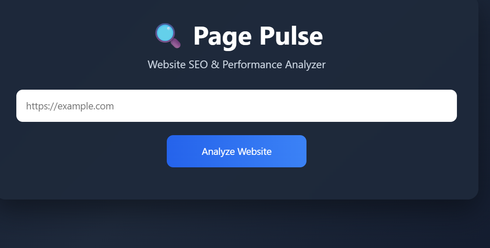
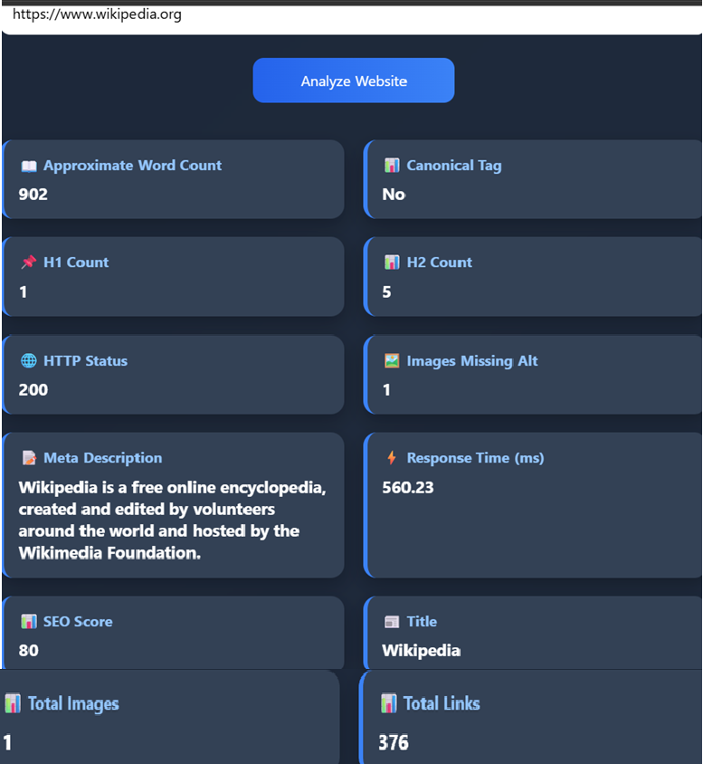

#  Page Pulse – Website SEO & Performance Analyzer

A modern web application that analyzes a website's SEO and performance metrics using Python, Flask, BeautifulSoup, HTML, CSS, and JavaScript.


## Overview

Page Pulse allows users to analyze any website by entering its URL. The application extracts important SEO metrics and presents them in a clean, responsive dashboard.


## Features

- 🌐 Website URL Analysis
- 📊 SEO Score Calculation
- ⚡ Response Time Measurement
- 🌍 HTTP Status Detection
- 📑 Page Title Extraction
- 📝 Meta Description Detection
- 📌 H1 & H2 Tag Analysis
- 🖼️ Image ALT Tag Analysis
- 🔗 Total Links Count
- 🖼️ Total Images Count
- 📚 Canonical Tag Detection
- ✅ URL Validation
- ⚠️ Error Handling
- 🧪 Automated Unit Testing


## Tech Stack

### Backend
- Python
- Flask
- BeautifulSoup4
- Requests

### Frontend
- HTML5
- CSS3
- JavaScript

### Testing
- Python unittest


## Project Structure

```text
DigitalHeroes-PagePulse/
│
├── app.py
├── requirements.txt
├── README.md
├── .gitignore
│
├── frontend/
│   ├── index.html
│   ├── style.css
│   └── script.js
│
├── screenshots/
│   ├── home.png
│   └── analysis.png
│
└── tests/
    └── test_app.py
```


## Installation

Clone the repository:

```bash
git clone https://github.com/vishaalicfis-eng/DigitalHeroes-PagePulse.git
```

Move into the project:

```bash
cd DigitalHeroes-PagePulse
```

Install dependencies:

```bash
pip install -r requirements.txt
```

Run the application:

```bash
python app.py
```

Open your browser:

```
http://127.0.0.1:5000
```


## Usage

1. Enter a website URL.
2. Click **Analyze Website**.
3. View SEO and performance metrics instantly.

## Screenshots

### Home Page



### Analysis Results



## Metrics Displayed

- SEO Score
- HTTP Status
- Response Time
- Title
- Meta Description
- H1 Count
- H2 Count
- Total Images
- Images Missing ALT
- Total Links
- Canonical Tag
- Approximate Word Count


##  Running Tests

```bash
python -m unittest tests/test_app.py
```


## Future Improvements

- Export PDF Reports
- Lighthouse API Integration
- Keyword Density Analysis
- PageSpeed Insights Integration
- Authentication System
- Analysis History
- Dark/Light Theme Toggle


## Author

**Vishaali R**

GitHub: https://github.com/vishaalicfis-eng


## License

This project was developed for the **Digital Heroes Software Development Internship Assignment**.